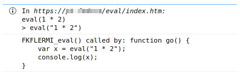
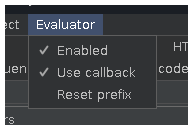
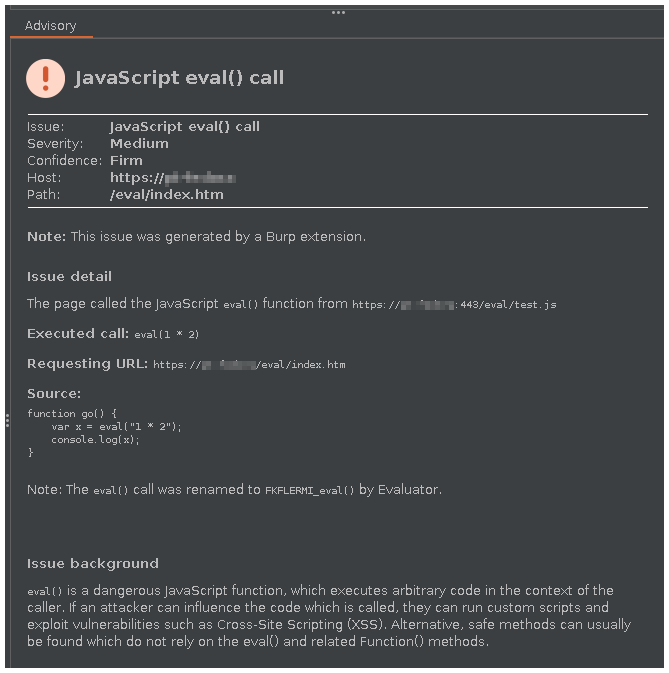
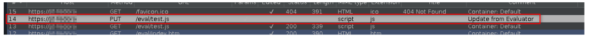

## Evaluator

[Burp](https://portswigger.net/burp) extension to help identify and exploit applications which use the JavaScript `eval()` function. The extension will modify references to `eval()` in JavaScript files (but not inline code in HTML files), causing them to log the call to the browser console. To do this, the original `eval()` call is replaced by a call to a randomly named version, e.g. `FKFLERMI_eval()`. 

Note: the extension _only_ affects script files which are In Scope in Burp.

The "Info" log will show the executed call, and (usually) the exact call as passed to the method (e.g. an unevaluated string).

If if can be determined, the "Debug" log will show the section of JavaScript containing the call.

After installing the extensions, there will be a new menu in Burp:

Using this you can enable/disable the extension, and reset the random prefix used for the new function.

If enabled, the injected JavaScript code will also call back to Burp to generate an issue:

It does this by making a PUT request to the URL for the JavaScript file, with a JSON payload and a custom `X-EVALUATOR` header. The extension detects this request, uses the payload to generate the issue, adds a comment to the request, and drops it. 

This does mean that there will be requests in the Burp Proxy log, but these can be filtered out. The easiest way is to enable "Hide items without responses" in the Proxy filter. Alternatively, use "Filter by search term" for "X-EVALUATOR" with a "Negative search".

